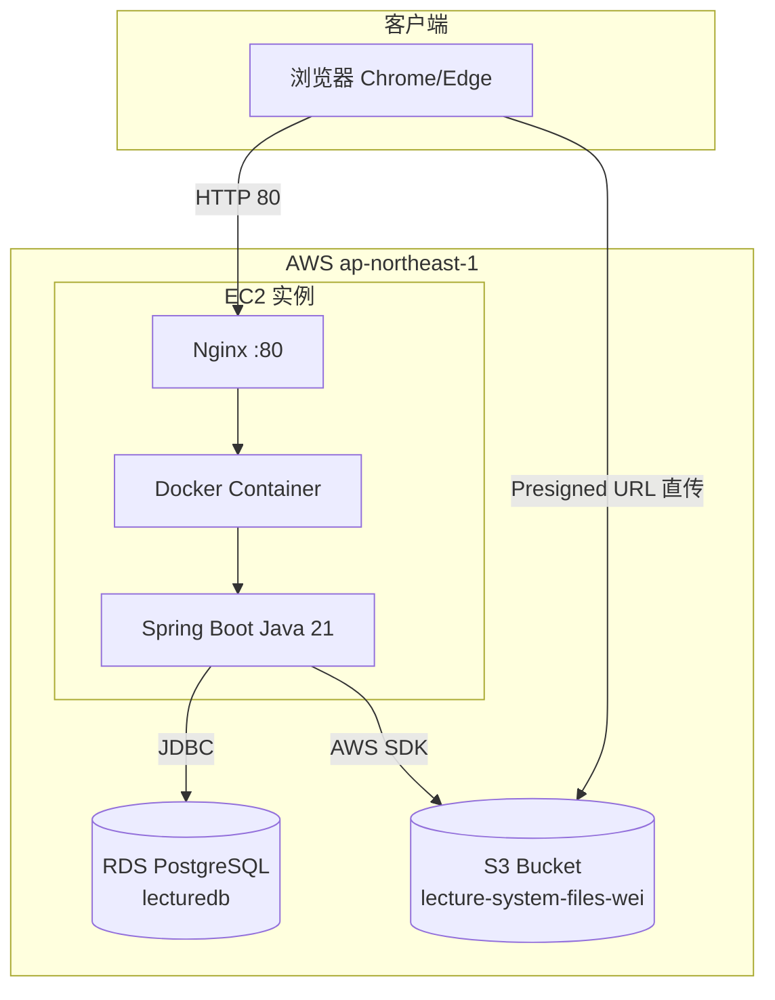

# AWS 架构图 — 发表用

## 整体架构（面试 / 社长说明用）



---

## 请求类型说明

| 操作 | 路径 | 存储 |
|------|------|------|
| 登录、页面 | Browser → EC2 → RDS | Session + users 表 |
| 教材/作业/头像上传 | Browser → EC2 拿 Presigned URL → Browser PUT → S3 | S3 + DB 记 key |
| 教材/作业下载 | Browser ← EC2 生成 Presigned GET ← S3 | 临时 URL |
| 聊天消息 | Browser → EC2 → RDS | chat_messages 表 |

---

## 安全组（要记住的）

| 端口 | 用途 | 谁可访问 |
|------|------|----------|
| 80 | 网站 HTTP | 0.0.0.0/0（全世界） |
| 22 | SSH 维护 | 仅特定 IP（マイ IP） |

---

## 部署命令（EC2）

```bash
cd ~/lecture-management-system
git pull
./mvnw clean package -DskipTests
sudo docker restart app-app-1
```

---

## 发表时指图说话（日语 60 秒）

> ユーザーは EC2 上の Nginx 経由で Spring Boot にアクセスします。  
> データは RDS PostgreSQL に保存し、  
> PDF や画像は S3 に保存します。  
> アップロード時は Presigned URL を使い、  
> ブラウザから S3 へ直接転送することで EC2 の負荷を抑えています。

---

## 和 CloudFront 的关系（如果被问）

当前版本：**没有使用 CloudFront**。  
静态 CSS 由 Spring Boot 直接从 `static/` 提供。  
将来可把 `pcfa-theme.css` 放到 S3 + CloudFront 加速。

---

## 和 Lambda 的关系（如果被问）

当前版本：**聊天不用 Lambda**。消息存 RDS，未读用 `chat_read_status` 表。  
Lambda + CloudWatch 是将来实时通知的扩展方案。
